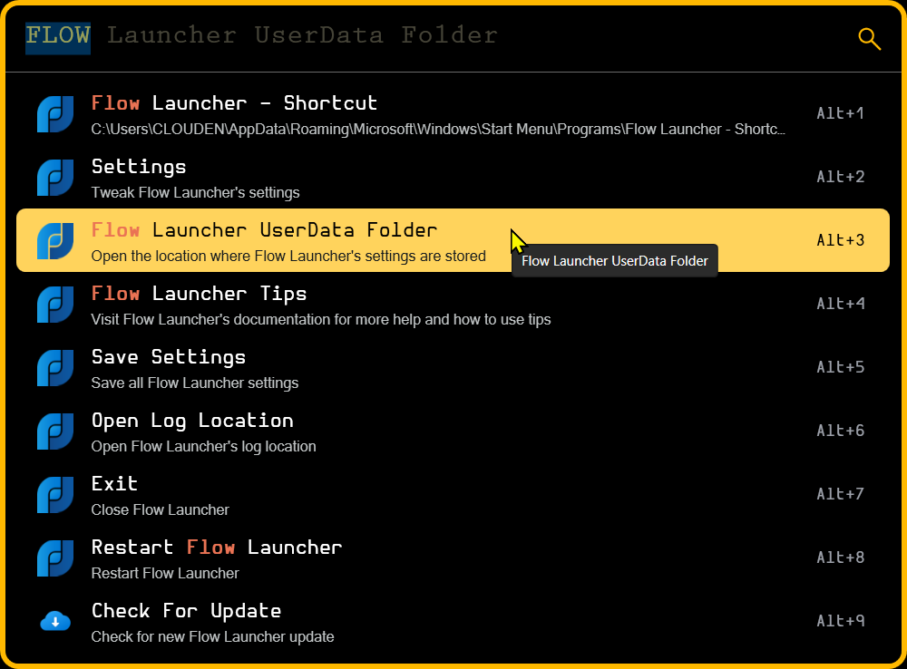

# 🎨 Gold Box Flow.Laucher Theme

A theme for **[Flow Launcher](https://github.com/Flow-Launcher/Flow.Launcher)** that I tweaked with thankful inspiration from [CircleDarkBlur.Flow-Launcher](https://github.com/z1nc0r3/CircleDarkBlur.Flow-Launcher)

## 📷 Screenshots


## ✔ Features

- Dark mode with Bright Colors
	- Colors Gold\\Yellow Highlights (Stands out on dark themes)
- Thick Gold Boarder! (Again, easy to find in the dark)
	- Extra-Rounded corners
- Large Search Box (Good for Big Screens, I'm on a 48in 4k)
- Acrylic/Glass/Blur effect on background

# 💾 Easy Installation 

- Download & Extract the `Gold Box.xaml` from this [repo](https://github.com/indigofairyx/GoldBox.Theme)
- Or Save the `.xaml` directly from [Gold Box.xaml](https://raw.githubusercontent.com/indigofairyx/GoldBox.Theme/main/Gold%20Box.xaml) Then save the file using `Ctrl` + `S` from your web browser.

Flow Launcher has a built in feature to open your UserData Folder (see below) place the `.xaml` in `UserData\Themes`.



***


## Manual Installation 

- Download & Extract the `Gold Box.xaml` from this [repo](https://github.com/indigofairyx/GoldBox.Theme)
- Or Save the `.xaml` directly from [Gold Box.xaml](https://raw.githubusercontent.com/indigofairyx/GoldBox.Theme/main/Gold%20Box.xaml) Then save the file using `Ctrl` + `S` from your web browser.

### For a Stand Standard install place the `.xaml` here...
***
```
%AppData%\FlowLauncher\Themes
```

You can Copy & Paste this shortcut into explorer. Easy!

### For a Portable Place the `.xaml` here.. 
***
`C:\Users%YOUR USER NAME%\AppData\Local\FlowLauncher\%app-1.18.0%\UserData\Themes`

If your portable install is somewhere else place it in `FlowLauncher\%app-1.xx.x%\UserData\Themes`

> [!IMPORTANT]
> The `%app-1.18.0%` folder name **will change** with each Flow Launcher update.
***
> ***Restart Flow Launcher so it sees the theme in the *Appearance* tab in settings!***

